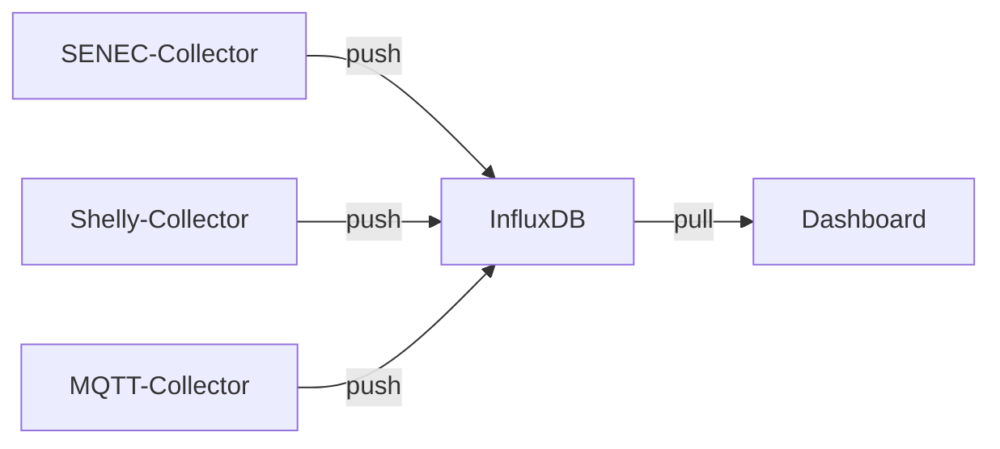
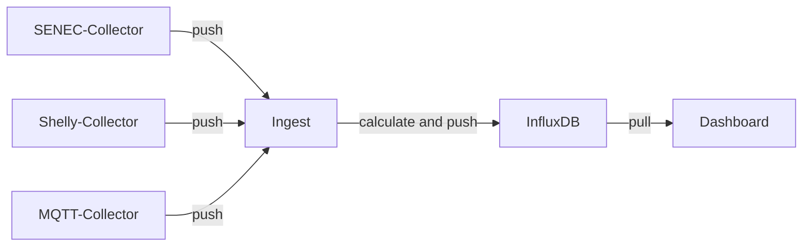

[](https://github.com/solectrus/ingest/actions/workflows/ci.yml)
[](https://codeclimate.com/repos/67e7ae6e01e8297f4ba58b5c/maintainability)
[](https://wakatime.com/badge/user/697af4f5-617a-446d-ba58-407e7f3e0243/project/3d478bcc-754c-4d6b-9a2d-fe70bf9eea9f)
[](https://codeclimate.com/repos/67e7ae6e01e8297f4ba58b5c/test_coverage)

# SOLECTRUS Ingest

Lightweight InfluxDB ingestion proxy with **buffering** und **house power calculation**.

## Features

- Accepts InfluxDB v2 Line Protocol via HTTP
- Forwards all incoming data to InfluxDB
- Recalculates house power and overrides incoming house power
- Buffers all writes to SQLite (12 hours retention)
- Exposes a statistics endpoint (protected by basic auth)

## Architecture

### Without Ingest



### With Ingest



## House Power Calculation

Installing a balcony inverter can lead to incorrect house power readings. Ingest recalculates the value using this formula:

```
HOUSE_POWER = INVERTER_POWER
            + BALCONY_INVERTER_POWER
            + GRID_IMPORT_POWER
            + BATTERY_DISCHARGING_POWER
            - BATTERY_CHARGING_POWER
            - GRID_EXPORT_POWER
            - WALLBOX_POWER
            - HEATPUMP_POWER
```

## Example Docker Compose

```yaml
services:
  ingest:
    image: ghcr.io/solectrus/ingest:latest
    environment:
      - INFLUX_SENSOR_INVERTER_POWER
      - INFLUX_SENSOR_BALCONY_INVERTER_POWER
      - INFLUX_SENSOR_GRID_IMPORT_POWER
      - INFLUX_SENSOR_GRID_EXPORT_POWER
      - INFLUX_SENSOR_BATTERY_DISCHARGING_POWER
      - INFLUX_SENSOR_BATTERY_CHARGING_POWER
      - INFLUX_SENSOR_WALLBOX_POWER
      - INFLUX_SENSOR_HEATPUMP_POWER
      - INFLUX_SENSOR_HOUSE_POWER
      - INFLUX_EXCLUDE_FROM_HOUSE_POWER
      - INFLUX_HOST
      - INFLUX_PORT
      - INFLUX_SCHEMA
      - STATS_USERNAME
      - STATS_PASSWORD
    depends_on:
      - influxdb
    ports:
      - '4567:4567'
    volumes:
      - ./path/to/my/ingest-folder:/app/data

  influxdb:
    image: influxdb:2.7-alpine
    ports:
      - '8086:8086'
    volumes:
      - ./path/to/my/influx-folder:/var/lib/influxdb
```

## Environment Variables

| Variable                                  | Description                                             |
| ----------------------------------------- | ------------------------------------------------------- |
| `INFLUX_SENSOR_INVERTER_POWER`            | Measurement/Field for inverter power                    |
| `INFLUX_SENSOR_BALCONY_INVERTER_POWER`    | Measurement/Field for balcony inverter power            |
| `INFLUX_SENSOR_GRID_IMPORT_POWER`         | Measurement/Field for grid import power                 |
| `INFLUX_SENSOR_GRID_EXPORT_POWER`         | Measurement/Field for grid export power                 |
| `INFLUX_SENSOR_BATTERY_DISCHARGING_POWER` | Measurement/Field for battery discharging power         |
| `INFLUX_SENSOR_BATTERY_CHARGING_POWER`    | Measurement/Field for battery charging power            |
| `INFLUX_SENSOR_WALLBOX_POWER`             | Measurement/Field for wallbox power                     |
| `INFLUX_SENSOR_HEATPUMP_POWER`            | Measurement/Field for heat pump power                   |
| `INFLUX_SENSOR_HOUSE_POWER`               | Measurement/Field for house power                       |
| `INFLUX_EXCLUDE_FROM_HOUSE_POWER`         | Exclude sensors from house power calculation            |
| `INFLUX_SENSOR_HOUSE_POWER_CALCULATED`    | Measurement/Field for calculated house power (optional) |
| `INFLUX_HOST`                             | InfluxDB host, e.g. "influxdb"                          |
| `INFLUX_PORT`                             | InfluxDB port, e.g. "8086"                              |
| `INFLUX_SCHEMA`                           | InfluxDB schema, e.g. "http"                            |
| `STATS_USERNAME`                          | Username for stats endpoint (optional)                  |
| `STATS_PASSWORD`                          | Password for stats endpoint (optional)                  |

## Endpoints

Ingest acts as a proxy for the InfluxDB v2 API, specifically `/api/v2/write`. It accepts data in InfluxDB Line Protocol format and forwards it to InfluxDB.

### POST `/api/v2/write`

- **Headers:**

  - `Authorization: Token <token>`
  - `Content-Type: application/json`

- **Query Params:**

  - `bucket`: Target bucket
  - `org`: Target organization
  - `precision`: Timestamp precision (default: `ns`)

- **Body:** InfluxDB Line Protocol

- **Behavior:**
  - Buffers incoming data
  - Recalculates house power if relevant
  - Adds processed data to the write queue

### GET `/`

Basic web UI for service monitoring.

If you have set `STATS_USERNAME` and `STATS_PASSWORD`, you will be prompted for credentials (HTTP Basic Auth).

### GET `/up`

Returns HTTP 200 if the service is up and running.

## Example cURL

Ingest is compatible with InfluxDB v2 and listens to the `/api/v2/write` endpoint:

This example sends a measurement called `test_measurement` with a tag `location=office` and a value of `42` to the Ingest service. The timestamp is set to the current time in nanoseconds.

```bash
curl -X POST "http://localhost:4567/api/v2/write?bucket=my-bucket&org=my-org&precision=ns" \
  -H "Authorization: Token my-token" \
  -H "Content-Type: application/json" \
  --data-raw "test_measurement,location=office value=42i $(( $(date +%s) * 1000000000 ))"
```

## How it works

- Incoming data is **persisted** in SQLite
- An `OutboxWorker` forwards queued writes to InfluxDB in **batches**
- `HousePowerCalculator` triggers on relevant updates
- `CleanupWorker` deletes old buffered data after 12 hours

## FAQ

### Should I use Ingest?

Only if you use a balcony inverter **and** your house power is calculated incorrectly. If you have a single inverter, Ingest would not add any value in this case (beside warming up your Raspberry Pi).

### Should I use Ingest for other collectors?

It's strongly recommended to use Ingest for collectors sending **any of the eight relevant sensors** only.

All other collectors (e.g., [Tibber-Collector](https://github.com/solectrus/tibber-collector/), [Forecast-Collector](https://github.com/solectrus/forecast-collector), ...) should send data **directly** to InfluxDB, because this is more efficient and doesn't require any additional processing.

### Why not use Telegraf?

[Telegraf](https://www.influxdata.com/time-series-platform/telegraf/) is an **agent** that collects and pushes data. Ingest is a **proxy** that accepts incoming data and processes it. This allows reusing existing collectors by only changing their destination URL.
