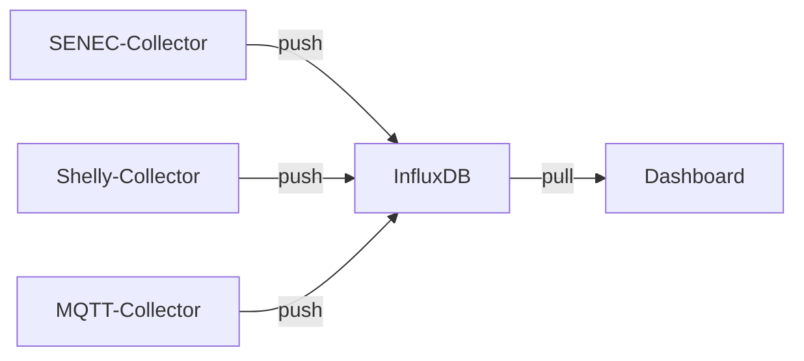
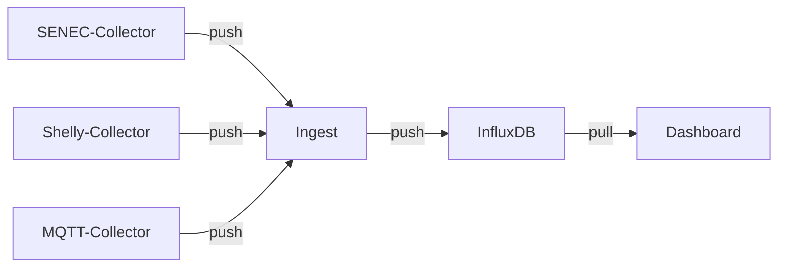

[](https://github.com/solectrus/ingest/actions/workflows/ci.yml)
[](https://codeclimate.com/repos/67e7ae6e01e8297f4ba58b5c/maintainability)
[](https://wakatime.com/badge/user/697af4f5-617a-446d-ba58-407e7f3e0243/project/3d478bcc-754c-4d6b-9a2d-fe70bf9eea9f)
[](https://codeclimate.com/repos/67e7ae6e01e8297f4ba58b5c/test_coverage)

# SOLECTRUS Ingest

Lightweight InfluxDB ingestion proxy with **buffering** and **house power calculation**.

## Features

- Accepts InfluxDB v2 Line Protocol via HTTP
- Forwards all incoming data to InfluxDB
- Recalculates house power and replaces incoming value
- Buffers all incoming and outgoing data to SQLite
- Exposes a statistics endpoint

## Architecture

### Without Ingest



### With Ingest



## House Power Calculation

When using a balcony inverter, your house power value might be incorrect. Ingest recalculates the value using this formula:

```
HOUSE_POWER = INVERTER_POWER (total, including balcony inverter)
            + GRID_IMPORT_POWER
            + BATTERY_DISCHARGING_POWER
            - BATTERY_CHARGING_POWER
            - GRID_EXPORT_POWER
            - WALLBOX_POWER
            - HEATPUMP_POWER
```

Since the relevant sensor values may not arrive simultaneously, Ingest uses **interpolation** to align them. Whenever one of the relevant sensors updates, Ingest recalculates the house power based on that timestamp.

The calculated value replaces the original one. If you prefer to store the original value separately, you can define `INFLUX_SENSOR_HOUSE_POWER_CALCULATED` to write the result to a different measurement and/or field.

## Example Docker Compose

```yaml
services:
  ingest:
    image: ghcr.io/solectrus/ingest:latest
    environment:
      - INFLUX_SENSOR_INVERTER_POWER
      - INFLUX_SENSOR_BALCONY_INVERTER_POWER
      - INFLUX_SENSOR_INVERTER_POWER_1
      - INFLUX_SENSOR_INVERTER_POWER_2
      - INFLUX_SENSOR_INVERTER_POWER_3
      - INFLUX_SENSOR_INVERTER_POWER_4
      - INFLUX_SENSOR_INVERTER_POWER_5
      - INFLUX_SENSOR_GRID_IMPORT_POWER
      - INFLUX_SENSOR_GRID_EXPORT_POWER
      - INFLUX_SENSOR_BATTERY_DISCHARGING_POWER
      - INFLUX_SENSOR_BATTERY_CHARGING_POWER
      - INFLUX_SENSOR_WALLBOX_POWER
      - INFLUX_SENSOR_HEATPUMP_POWER
      - INFLUX_SENSOR_HOUSE_POWER
      - INFLUX_EXCLUDE_FROM_HOUSE_POWER
      - INFLUX_SENSOR_HOUSE_POWER_CALCULATED
      - INFLUX_HOST
      - INFLUX_PORT
      - INFLUX_SCHEMA
      - STATS_PASSWORD
    depends_on:
      - influxdb
    ports:
      - 4567:4567
    volumes:
      - ./path/to/ingest-data:/app/data

  influxdb:
    image: influxdb:2.7-alpine
    ports:
      - 8086:8086
    volumes:
      - ./path/to/influx-data:/var/lib/influxdb
```

Note: `INFLUX_SENSOR_BALCONY_INVERTER_POWER`is deprecated and wil be removed soon.

## Environment Variables

### Sensor Configuration

Define measurement and field names for each sensor. Format: `measurement:field`, e.g. `SENEC:inverter_power`. Leave empty if a sensor is not available.

| Variable                                  | Description                             |
| ----------------------------------------- | --------------------------------------- |
| `INFLUX_SENSOR_INVERTER_POWER`            | Inverter power (total)                  |
| `INFLUX_SENSOR_INVERTER_POWER_1`          | Inverter power (1)                      |
| `INFLUX_SENSOR_INVERTER_POWER_2`          | Inverter power (2)                      |
| `INFLUX_SENSOR_INVERTER_POWER_3`          | Inverter power (3)                      |
| `INFLUX_SENSOR_INVERTER_POWER_4`          | Inverter power (4)                      |
| `INFLUX_SENSOR_INVERTER_POWER_5`          | Inverter power (5)                      |
| `INFLUX_SENSOR_BALCONY_INVERTER_POWER`    | Balcony inverter power **(deprecated)** |
| `INFLUX_SENSOR_GRID_IMPORT_POWER`         | Grid import power                       |
| `INFLUX_SENSOR_GRID_EXPORT_POWER`         | Grid export power                       |
| `INFLUX_SENSOR_BATTERY_DISCHARGING_POWER` | Battery discharging power               |
| `INFLUX_SENSOR_BATTERY_CHARGING_POWER`    | Battery charging power                  |
| `INFLUX_SENSOR_WALLBOX_POWER`             | Wallbox power                           |
| `INFLUX_SENSOR_HEATPUMP_POWER`            | Heat pump power                         |
| `INFLUX_SENSOR_HOUSE_POWER`               | House power                             |

The inverter power is calculated as follows:

1. If `INFLUX_SENSOR_BALCONY_INVERTER_POWER` is given:

```
Total inverter power = INFLUX_SENSOR_INVERTER_POWER +
                       INFLUX_SENSOR_BALCONY_INVERTER_POWER
```

Note: This is deprecated and will be removed soon.

2. Otherwise, if `INFLUX_SENSOR_INVERTER_POWER` power is given:

```
Total inverter power = INFLUX_SENSOR_INVERTER_POWER
```

3. Otherwise, if `INFLUX_SENSOR_INVERTER_POWER` is **not** given:

```
Total inverter power = INFLUX_SENSOR_INVERTER_POWER_1 +
                       INFLUX_SENSOR_INVERTER_POWER_2 +
                       INFLUX_SENSOR_INVERTER_POWER_3 +
                       INFLUX_SENSOR_INVERTER_POWER_4 +
                       INFLUX_SENSOR_INVERTER_POWER_5
```

### Other Settings

| Variable                               | Description                               | Note            |
| -------------------------------------- | ----------------------------------------- | --------------- |
| `INFLUX_EXCLUDE_FROM_HOUSE_POWER`      | Exclude specific sensors from house power | Optional        |
| `INFLUX_SENSOR_HOUSE_POWER_CALCULATED` | Output for calculated house power         | Optional        |
| `INFLUX_HOST`                          | InfluxDB host, e.g. `influxdb`            | Required        |
| `INFLUX_PORT`                          | InfluxDB port                             | Default: `8086` |
| `INFLUX_SCHEMA`                        | InfluxDB schema                           | Default: `http` |
| `STATS_PASSWORD`                       | Password for stats endpoint               | Optional        |

## Endpoints

### POST `/api/v2/write`

Stores and forwards incoming Line Protocol data to InfluxDB. Triggers recalculation of house power if relevant.

### GET `/`

Displays a basic stats page (requires password if configured), showing throughput, queue size, buffer status, etc.

### GET `/health`

Returns JSON with HTTP 200 if the service is running (useful for detailed health checks).

### GET `/ping`

Returns just HTTP 204 if the service is running (useful for health checks).

## Example cURL

```bash
curl -X POST "http://localhost:4567/api/v2/write?bucket=my-bucket&org=my-org&precision=ns" \
  -H "Authorization: Token my-token" \
  -H "Content-Type: application/json" \
  --data-raw "test_measurement,location=office value=42i $(( $(date +%s) * 1000000000 ))"
```

## How it works

- Incoming data is **persisted** in SQLite (12-hour retention)
- A queue forwards data to InfluxDB in **batches**
- House power is recalculated **as soon as** any relevant sensor updates
- Old data is removed periodically by a background cleanup worker

If anything goes wrong, please look at the logs!

## FAQ

### Should I use Ingest?

Only if you use a balcony inverter **and** your house power values are inaccurate. If you're using a single inverter, Ingest won't add value (except heating your Raspberry Pi).

### Should I use Ingest for all collectors?

Use Ingest only for collectors that send **any of the eight relevant sensors**.

All other collectors (e.g., [Tibber-Collector](https://github.com/solectrus/tibber-collector), [Forecast-Collector](https://github.com/solectrus/forecast-collector)) should send data **directly** to InfluxDB for better performance and simplicity.

### Why not use Telegraf?

[Telegraf](https://www.influxdata.com/time-series-platform/telegraf/) is an **agent** for data collection. Ingest is a **proxy** that processes and forwards data. This makes it easier to reuse existing collectors by simply changing the destination URL.
