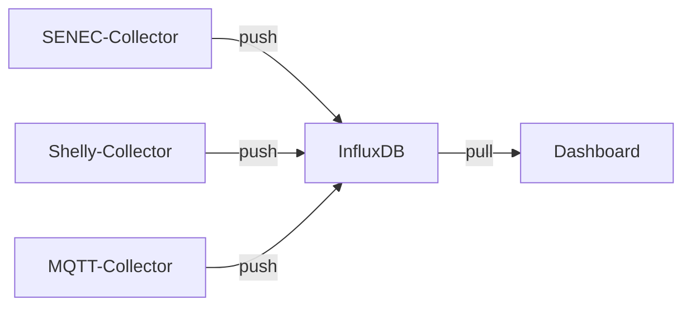
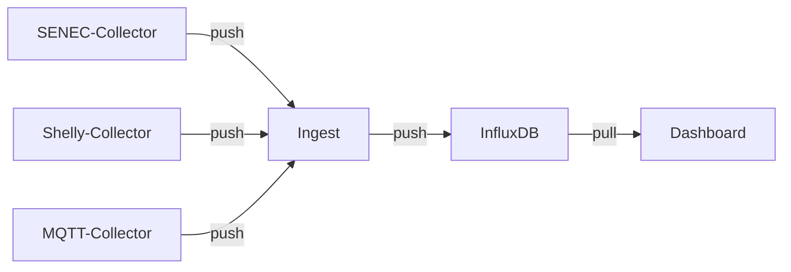

[](https://github.com/solectrus/ingest/actions/workflows/ci.yml)
[](https://qlty.sh/gh/solectrus/projects/ingest)
[](https://wakatime.com/badge/user/697af4f5-617a-446d-ba58-407e7f3e0243/project/3d478bcc-754c-4d6b-9a2d-fe70bf9eea9f)
[](https://qlty.sh/gh/solectrus/projects/ingest)

# SOLECTRUS Ingest

Lightweight InfluxDB ingestion proxy. It corrects the house power of a PV system with a balcony inverter.

## The problem it solves

A balcony inverter feeds power into a socket of your house grid. It sits behind the meter of your main system. Your battery system and your roof inverter never see this power.

They compute the house power from what they measure:

```
HOUSE_POWER = INVERTER_POWER
            + GRID_IMPORT_POWER
            - GRID_EXPORT_POWER
            + BATTERY_DISCHARGING_POWER
            - BATTERY_CHARGING_POWER
```

The balcony inverter reduces the grid import. So the result is too low by exactly the power of the balcony inverter. Your dashboard shows a house that uses less energy than it really does.

Ingest sits between your collectors and InfluxDB. It adds the balcony inverter to the sum and replaces the wrong value.

## Why not Home Assistant or ioBroker?

The formula is simple arithmetic. A template sensor in Home Assistant or a script in ioBroker can add the terms. The sum is not the hard part. The alignment in time is.

### 1. They compute with the current state, not with the timestamp

A template sensor in Home Assistant, or a script in ioBroker, runs when one input changes. It then reads the current value of every other input. That value is the last one that arrived, whatever its age.

The sensors of a PV system do not report at the same rate. A battery system reports every few seconds. A smart plug reports every 30 seconds. A balcony inverter over MQTT reports once a minute or slower. So the sum adds one fresh value to values that are up to a minute old.

Under a load that changes fast, this error is larger than the correction you want. A kettle that starts between two reports of the balcony inverter moves the result by 2000 W.

Both platforms do keep a history. Home Assistant has the recorder, with the `sql` integration and the `recorder.get_statistics` action on top of it. ioBroker has the history adapters. But each of them gives you one query per sensor, on its own polling interval. None of them gives you the aligned value of eight sensors at one exact moment.

Ingest stores every sample with its own timestamp. For the moment of the trigger, it interpolates each term between the two samples that surround that moment. Every term of the sum then belongs to the same moment.

### 2. They cannot write into the past

This is the difference that no amount of work removes. Home Assistant and ioBroker can read their history, but they cannot add a value to it. Every result of a calculation enters as a state change now, and the export to InfluxDB follows that state change.

If a collector delivers a batch of older points, the house power for those moments is never computed. This happens after a restart of a collector, and after every network problem. The gap stays in your data.

Ingest works on the timestamp of each line, not on the present. A batch of 5000 old points gets 5000 corrected values, each one at its own timestamp.

### What you get for free

Ingest also refuses to give you a wrong number. Every term of the formula needs a sample that is less than 15 minutes old. If one term is too old, Ingest writes no house power at all, and the stats page names the sensor that caused the skip.

You can do this in Home Assistant with `states.sensor.balcony_power.last_updated`, and in ioBroker with the `ts` field of `getState()`. Both are one line. But you have to think of it first, and you have to think of it for all eight terms.

### Can you build this yourself?

Interpolation, staleness detection, and a write path that carries its own timestamps are all possible on both platforms. It is a project, not a template sensor. Ingest is that project, and it costs you one URL change in your collectors.

## Do you need Ingest?

Use Ingest when both of these are true:

- You have a balcony inverter, or another producer that your main system cannot measure.
- Your house power values are too low.

If you have one inverter only, your house power is already correct. Ingest then adds nothing, except load on your Raspberry Pi.

## Installation with HELIOS

[HELIOS](https://github.com/solectrus/helios) configures your SOLECTRUS installation. It adds Ingest to your Docker Compose file and sets every environment variable. You do not install or configure Ingest yourself.

HELIOS adds Ingest only when both of these are true:

- Your configuration has at least one balcony sensor.
- Every sensor of the formula comes from a collector that HELIOS manages.

If one input arrives from an external source, HELIOS leaves Ingest out. Ingest then sees a part of the data only, and a house power from partial data is worse than no correction at all. In this case the external source must deliver a correct house power itself.

This is why the SOLECTRUS integrations for [Home Assistant](https://github.com/solectrus/ha-integration) and [ioBroker](https://github.com/solectrus/iobroker-adapter) do not use Ingest. They write to InfluxDB directly, and you compute the house power on that side.

## Architecture

### Without Ingest


```mermaid
graph LR
  CollectorA[SENEC-Collector]
  CollectorB[Shelly-Collector]
  CollectorC[MQTT-Collector]
  Influx[InfluxDB]
  Dashboard[Dashboard]

  CollectorA -->|push| Influx
  CollectorB -->|push| Influx
  CollectorC -->|push| Influx
  Influx -->|pull| Dashboard
```

### With Ingest


```mermaid
graph LR
  CollectorA[SENEC-Collector]
  CollectorB[Shelly-Collector]
  CollectorC[MQTT-Collector]
  Influx[InfluxDB]
  Ingest[Ingest]
  Dashboard[Dashboard]

  CollectorA -->|push| Ingest
  CollectorB -->|push| Ingest
  CollectorC -->|push| Ingest
  Ingest -->|push| Influx
  Influx -->|pull| Dashboard
```

Ingest accepts InfluxDB v2 [Line Protocol](https://docs.influxdata.com/influxdb/v2/reference/syntax/line-protocol/) over HTTP, so a collector needs a new destination URL and nothing else. It forwards every line. If one line does not parse, Ingest skips that line and forwards the rest of the request.

## House Power Calculation

Ingest recalculates the house power with this formula:

```
HOUSE_POWER = INVERTER_POWER (total, including balcony inverter)
            + GRID_IMPORT_POWER
            + BATTERY_DISCHARGING_POWER
            - BATTERY_CHARGING_POWER
            - GRID_EXPORT_POWER
            - WALLBOX_POWER
            - HEATPUMP_POWER
```

Whenever one of these sensors updates, Ingest recalculates the house power for the timestamp of that update.

### Interpolation

The relevant sensor values do not arrive at the same moment. For each term, Ingest finds the two samples that surround the target timestamp and interpolates between them. If no later sample exists yet, Ingest takes the last one, but only when it is less than 15 minutes old.

### Stale sensors

All configured sensors must contribute a value. If one of them is older than 15 minutes, Ingest skips the recalculation and writes no house power point.

The formula needs every term. If a term is missing, the result is wrong. Ingest does not replace the missing term with a guess, so it writes nothing at all. A gap in the dashboard is better than a wrong value in the database.

The stats page shows these skips as `Skipped (value missing)`, plus a `Missing values by sensor` list that names the sensors which caused them.

The `Configured sensors` list gives a second view. While a sensor delivers, the list shows its rate. If a sensor sends nothing for more than 15 minutes, the list shows the age of its last line instead. This is the same limit that the formula uses, so the list turns red at the moment when the sensor stops to contribute. The buffer keeps the lines of a stopped collector for the whole retention period, so the count and the rate stay unchanged.

So every configured sensor must send data continuously, even when its true value is zero. There are two different causes for a gap:

- The sensor is **broken or offline** and sends nothing at all. Then the gap is correct. Ingest cannot know whether the true value is zero, so it shows no value instead of a wrong one. Repair the sensor or the collector.
- The sensor still **sends, but without a value**. This is a configuration problem, and you can fix it in the collector. For the [MQTT-Collector](https://github.com/solectrus/mqtt-collector), set `MAPPING_X_NULL_TO_ZERO=true` to write a `0` when the payload holds no value. A balcony inverter that reports `null` at night is a typical example.

### Output

The calculated value replaces the original one. If you prefer to store the original value separately, you can define `INFLUX_SENSOR_HOUSE_POWER_CALCULATED` to write the result to a different measurement and/or field.

## The buffer

Ingest keeps every incoming line in SQLite, for 12 hours by default. This buffer is not a feature of its own. The interpolation needs the samples around a timestamp, so Ingest must hold them.

The buffer has two useful side effects:

- If InfluxDB is unreachable, no data is lost. Ingest keeps the lines and retries with the next batch.
- The stats page shows the rate of every sensor, so you find a collector that stopped.

A background worker forwards the queue to InfluxDB in batches and removes old data periodically.

## Example Docker Compose

```yaml
services:
  ingest:
    image: ghcr.io/solectrus/ingest:latest
    environment:
      - INFLUX_SENSOR_INVERTER_POWER
      - INFLUX_SENSOR_INVERTER_POWER_1
      - INFLUX_SENSOR_INVERTER_POWER_2
      - INFLUX_SENSOR_INVERTER_POWER_3
      - INFLUX_SENSOR_INVERTER_POWER_4
      - INFLUX_SENSOR_INVERTER_POWER_5
      - INFLUX_SENSOR_GRID_IMPORT_POWER
      - INFLUX_SENSOR_GRID_EXPORT_POWER
      - INFLUX_SENSOR_BATTERY_DISCHARGING_POWER
      - INFLUX_SENSOR_BATTERY_CHARGING_POWER
      - INFLUX_SENSOR_WALLBOX_POWER
      - INFLUX_SENSOR_HEATPUMP_POWER
      - INFLUX_SENSOR_HOUSE_POWER
      - INFLUX_EXCLUDE_FROM_HOUSE_POWER
      - INFLUX_SENSOR_HOUSE_POWER_CALCULATED
      - INFLUX_HOST
      - INFLUX_PORT
      - INFLUX_SCHEMA
      - STATS_PASSWORD
    depends_on:
      - influxdb
    ports:
      - 4567:4567
    volumes:
      -  # Just an example!
      -  # Change to a valid path on your system where Ingest can store its SQLite database
      - ./path/to/ingest-data:/app/data

  influxdb:
    image: influxdb:2.9-alpine
    ports:
      - 8086:8086
    volumes:
      -  # Just an example
      - ./path/to/influx-data:/var/lib/influxdb2
```

## Environment Variables

### Sensor Configuration

Define measurement and field names for each sensor. Format: `measurement:field`, for example `SENEC:inverter_power`. Leave a sensor empty when it is not available.

| Variable                                  | Description               |
| ----------------------------------------- | ------------------------- |
| `INFLUX_SENSOR_INVERTER_POWER`            | Inverter power (total)    |
| `INFLUX_SENSOR_INVERTER_POWER_1`          | Inverter power (1)        |
| `INFLUX_SENSOR_INVERTER_POWER_2`          | Inverter power (2)        |
| `INFLUX_SENSOR_INVERTER_POWER_3`          | Inverter power (3)        |
| `INFLUX_SENSOR_INVERTER_POWER_4`          | Inverter power (4)        |
| `INFLUX_SENSOR_INVERTER_POWER_5`          | Inverter power (5)        |
| `INFLUX_SENSOR_GRID_IMPORT_POWER`         | Grid import power         |
| `INFLUX_SENSOR_GRID_EXPORT_POWER`         | Grid export power         |
| `INFLUX_SENSOR_BATTERY_DISCHARGING_POWER` | Battery discharging power |
| `INFLUX_SENSOR_BATTERY_CHARGING_POWER`    | Battery charging power    |
| `INFLUX_SENSOR_WALLBOX_POWER`             | Wallbox power             |
| `INFLUX_SENSOR_HEATPUMP_POWER`            | Heat pump power           |
| `INFLUX_SENSOR_HOUSE_POWER`               | House power               |

The inverter power is calculated as follows:

1. If `INFLUX_SENSOR_INVERTER_POWER` power is given:

```
Total inverter power = INFLUX_SENSOR_INVERTER_POWER
```

2. Otherwise, if `INFLUX_SENSOR_INVERTER_POWER` is **not** given:

```
Total inverter power = INFLUX_SENSOR_INVERTER_POWER_1 +
                       INFLUX_SENSOR_INVERTER_POWER_2 +
                       INFLUX_SENSOR_INVERTER_POWER_3 +
                       INFLUX_SENSOR_INVERTER_POWER_4 +
                       INFLUX_SENSOR_INVERTER_POWER_5
```

### Other Settings

| Variable                               | Description                               | Note            |
| -------------------------------------- | ----------------------------------------- | --------------- |
| `INFLUX_EXCLUDE_FROM_HOUSE_POWER`      | Exclude specific sensors from house power | Optional        |
| `INFLUX_SENSOR_HOUSE_POWER_CALCULATED` | Output for calculated house power         | Optional        |
| `INFLUX_HOST`                          | InfluxDB host, for example `influxdb`     | Required        |
| `INFLUX_PORT`                          | InfluxDB port                             | Default: `8086` |
| `INFLUX_SCHEMA`                        | InfluxDB schema                           | Default: `http` |
| `RETENTION_HOURS`                      | SQLite retention period in hours          | Default: `12`   |
| `STATS_PASSWORD`                       | Password for stats endpoint               | Optional        |

## Endpoints

### POST `/api/v2/write`

Stores and forwards incoming Line Protocol data to InfluxDB. Triggers recalculation of house power if relevant.

### GET `/`

Shows a basic stats page (requires a password if configured), with throughput, queue size, buffer status, and more.

While a stream delivers, the page shows its rate. If a stream sends nothing for more than 15 minutes, the page shows the age of its last line instead.

Only a configured sensor gets a colour for this, because SOLECTRUS needs its value. In the `Other incoming data` list the age is a fact and not a fault. A collector can send slower on purpose, and Ingest does not know how often such a stream arrives.

### GET `/health`

Returns JSON with HTTP 200 if the service is running (useful for detailed health checks).

### GET `/ping`

Returns just HTTP 204 if the service is running (useful for health checks).

## Example cURL

```bash
curl -X POST "http://localhost:4567/api/v2/write?bucket=my-bucket&org=my-org&precision=ns" \
  -H "Authorization: Token my-token" \
  -H "Content-Type: application/json" \
  --data-raw "test_measurement,location=office value=42i $(( $(date +%s) * 1000000000 ))"
```

If anything goes wrong, please look at the logs!

## FAQ

### Should I use Ingest for all collectors?

You can. Ingest forwards every line it gets, and it starts a recalculation only when a line carries one of the eight relevant sensors. Everything else passes through untouched. So a collector that sends unrelated data costs you nothing but a row in the buffer.

Ingest needs the eight relevant sensors, so route those collectors through it. For the rest it is your choice. One point of care is a collector that writes a long time series in one request. The [Forecast-Collector](https://github.com/solectrus/forecast-collector) is the example. Such a series fills the buffer for the whole retention period and gets no benefit from it. Send that collector directly to InfluxDB.

### Why not use Telegraf?

[Telegraf](https://www.influxdata.com/time-series-platform/telegraf/) is an agent for data collection. Ingest is a proxy that processes and forwards data. So you can reuse your existing collectors and change the destination URL only.

### Does Ingest slow down my writes?

Ingest answers a write as soon as the line is safe in SQLite. The forwarding to InfluxDB runs in the background, in batches. Every line carries its own timestamp, so the moment it reaches InfluxDB changes no data.
